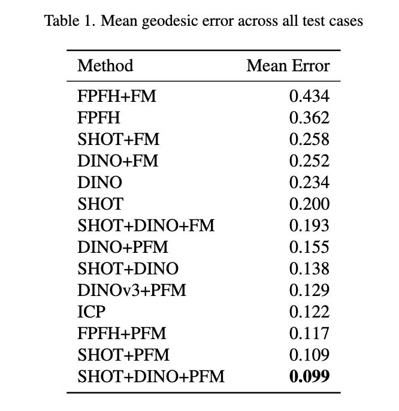

# Partial Functional Maps (PFM) - Python Implementation

Comprehensive Python implementation of partial functional maps and related methods for non-rigid shape matching, including state-of-the-art feature extraction and refinement techniques.


## Results



## Overview

This repository is a **Python reimplementation** of the [original MATLAB Partial Functional Maps (PFM) repository](https://github.com/pitbullil/PFM), based on the foundational paper:

**[Partial Functional Correspondence](https://arxiv.org/pdf/1506.05274)** by Rodolà et al.

The implementation reproduces the core PFM framework for establishing correspondences between 3D shapes with partial geometry. Beyond the original MATLAB implementation (which uses SHOT descriptors), this Python version extends the framework with:
- **Deep learning-based descriptors**: DINOv2 and DINOv3 (self-supervised vision transformers)
- **Additional classical descriptors**: FPFH (Fast Point Feature Histograms)
- **Flexible descriptor combinations**: Different types of descriptors can be freely combined.

## Installation

To install using pip/conda, run the following commands:

```bash
conda create -n PfmEnv python=3.11 -y
conda activate PfmEnv
conda config --set channel_priority strict
conda install pytorch torchvision torchaudio pytorch-cuda=11.8 "mkl<2024.1" "intel-openmp<2024.1" pytorch3d -c pytorch -c nvidia -c pytorch3d -y
conda install -c conda-forge matplotlib numpy scikit-learn scipy -y
pip install open3d robust_laplacian trimesh potpourri3d transformers huggingface-hub einops meshio opencv-python plyfile
```

## CLI Usage

PFM provides a simple CLI for single runs and dataset processing. The entry point is [pfm_py/main.py](pfm_py/main.py).

### Available CLI Options

#### Descriptor Selection (choose one or combine with `--desc`)
- `--fpfh` - Use FPFH descriptors (Fast Point Feature Histograms)
- `--shot` - Use SHOT descriptors (Signature of Histograms of Orientations)
- `--dino` - Use DINO (DINOv2) descriptors (requires pytorch3d and internet)
- `--dinov3` or `--dino3` - Use DINOv3 descriptors (requires pytorch3d, transformers and internet)
- `--desc <TYPE>` - Specify custom descriptor type (can be used multiple times, e.g., `--desc shot --desc fpfh`)
  - Supports combinations like `shot+dino` or `fpfh+dinov3`
  - Default: `fpfh` (if no descriptors specified)

#### Input/Output Paths
- `--full-mesh <PATH>` - Path to full mesh (.off file) or directory containing full meshes
  - If directory, auto-resolves full mesh from partial name
  - E.g., `horse_shape_14.off` tries candidates: `horse_shape_14.off` → `horse.off` → fallback to same basename
- `--partial-mesh <PATH>` - Path to partial mesh (.off file) to match
- `--gt-path <PATH>` - Optional path to ground truth correspondences (.vts file)
  - If omitted, GT-based metrics/visualizations are skipped
- `--target-path <PATH>` - Output results directory (default: `results`)
- `--shrec16 <PATH>` - Path to SHREC16 root directory (contains cuts/holes/null subdirectories)
  - Required for dataset mode (when `--full-mesh`/`--partial-mesh` not provided)

#### Visualization Options
- `--web-view` - Generate interactive HTML+JSON 3D viewer in result folder
  - Left panel: full mesh with continuous colors
  - Right panel: partial mesh with method/GT colors
  - Features: rotate, zoom, pan, method/GT toggle
- `--no-vis` - Skip generation of visualizations (functional map and color pullback images)

#### Optimization Overrides
- `--v-max-iter <INT>` - Override max iterations for v optimization (default: 2000)
- `--C-max-iter <INT>` - Override max iterations for functional map C optimization (default: 2000)
- `--max-outer-iter <INT>` - Override max outer loop iterations (default: 7)
- `--refine-iters <INT>` - Override refinement-stage outer iterations (default: same as `--max-outer-iter`; if omitted, it is set to `max_outer_iter`)
- `--early-stopping` - Enable early stopping in C and v optimization steps

### CLI Examples

```bash
# Single run with SHOT descriptors
python3 -m pfm_py.main \
   --full-mesh /path/to/full.off \
   --partial-mesh /path/to/partial.off \
   --shot \
   --target-path results/shot_single

# Single run with DINOv3 + ground truth
python3 -m pfm_py.main \
   --full-mesh /path/to/full.off \
   --partial-mesh /path/to/partial.off \
   --gt-path /path/to/corres.vts \
   --dinov3 \
   --target-path results/dinov3_with_gt

# Combine multiple descriptors
python3 -m pfm_py.main \
   --full-mesh /path/to/full.off \
   --partial-mesh /path/to/partial.off \
   --desc shot+fpfh \
   --target-path results/shot_fpfh_combined

# Auto-resolve full mesh from directory
python3 -m pfm_py.main \
   --full-mesh /path/to/shape_data/SHREC16/null/off \
   --partial-mesh /path/to/shape_data/SHREC16/cuts/off/cuts_horse_shape_14.off \
   --dinov3 \
   --target-path results/dinov3

# SHREC16 dataset with multiple descriptors and web viewer
python3 -m pfm_py.main \
   --shrec16 /path/to/shape_data/SHREC16 \
   --shot --fpfh \
   --target-path results \
   --web-view \
   --max-outer-iter 5 \
   --C-max-iter 1500 \
   --v-max-iter 1000

# Custom iteration parameters
python3 -m pfm_py.main \
   --full-mesh /path/to/full.off \
   --partial-mesh /path/to/partial.off \
   --dino \
   --v-max-iter 2000 \
   --C-max-iter 2000 \
   --max-outer-iter 7 \
   --refine-iters 7 \
   --early-stopping \
   --target-path results
```

### Output Files

When `--target-path` is specified, the following files are generated per mesh pair:
- `correspondences_{descriptor}.vts` - Computed pointwise correspondences (vertices of N → vertices of M), 1-indexed, one per line
- `functional_map_visualization_{descriptor}.png` - Visualizes the functional map **C** by spectrally pushing forward a coordinate-based RGB signal from N to M. The RGB components are treated as functions on N, which are then mapped to functions on M via C. Also shows the geodesic error heatmap (if GT available), the soft membership function **v**, and GT membership (if GT available).
- `functional_map_heatmap_{descriptor}.png` - Standalone heatmap visualization of the functional map matrix **C** with dimensions and color bar.
- `color_pullback_{descriptor}.png` - Visualizes the pointwise correspondences by pushing forward a coordinate-based RGB signal from N to M via the estimated (and optionally GT) matches. A good correspondence means the method push-forward looks like the GT push-forward.
- `interactive_view.html` - Interactive 3D web viewer, shows the color pullback (if `--web-view` enabled)

### Environment Variables

- `PFM_DINO_MODEL` - Override default DINO/DINOv3 model ID
- `HF_TOKEN` - Hugging Face token for accessing gated models (required for some model versions)

### Notes

- When `--full-mesh` is a directory, the CLI auto-resolves candidates from the partial mesh name
- Default descriptor is `fpfh` if none specified
- Multiple descriptors can be combined using `+` or `--desc` repeated multiple times
- Ground truth comparisons require GT file; omit `--gt-path` to skip GT-based metrics
- To run all available descriptors individually, use `--fpfh --shot --dino --dinov3` flags together

## Web Viewer (Interactive HTML)

- Purpose: Generate an interactive 3D page. Left panel shows the full mesh (continuous colors), right panel shows the partial mesh (method/GT colors), with rotate, zoom, pan and Method/GT toggle.
- Enable: Add `--web-view` to the CLI; an `interactive_view.html` is created per sample inside the result folder.

## Key Features

- **Spectral Methods**: Laplace-Beltrami eigenbasis computation with cotangent weights
- **Modern Features**: DINOv2 self-supervised features via multi-view rendering
- **Classical Descriptors**: SHOT and FPFH for geometric feature extraction
- **Refinement**: Both full and partial functional map refinement
- **Comprehensive Benchmarks**: Automated testing across multiple shape categories
- **Visualization**: Built-in tools for correspondence visualization

## Dataset

Benchmarks use the SHREC dataset with two challenge types:
- **cuts**: Shapes with removed parts
- **holes**: Shapes with topological holes

Test shapes include: cat, centaur, david, dog, horse, michael, victoria, wolf

## References

- [Partial Functional Correspondence](https://arxiv.org/pdf/1506.05274) - Rodolà et al.
- [Functional Maps Framework](https://arxiv.org/abs/1202.3673) - Ovsjanikov et al.
- [DINOv2: Learning Robust Visual Features](https://arxiv.org/abs/2304.07193) - Meta AI Research
- [DINOv3 Repository](https://github.com/facebookresearch/dinov3) - Meta AI Research
- SHOT Descriptor - Tombari et al.
- FPFH Descriptor - Rusu et al.
- [Original MATLAB PFM Repository](https://github.com/pitbullil/PFM/tree/master/pfm) - Reference implementation

## License

MIT License
