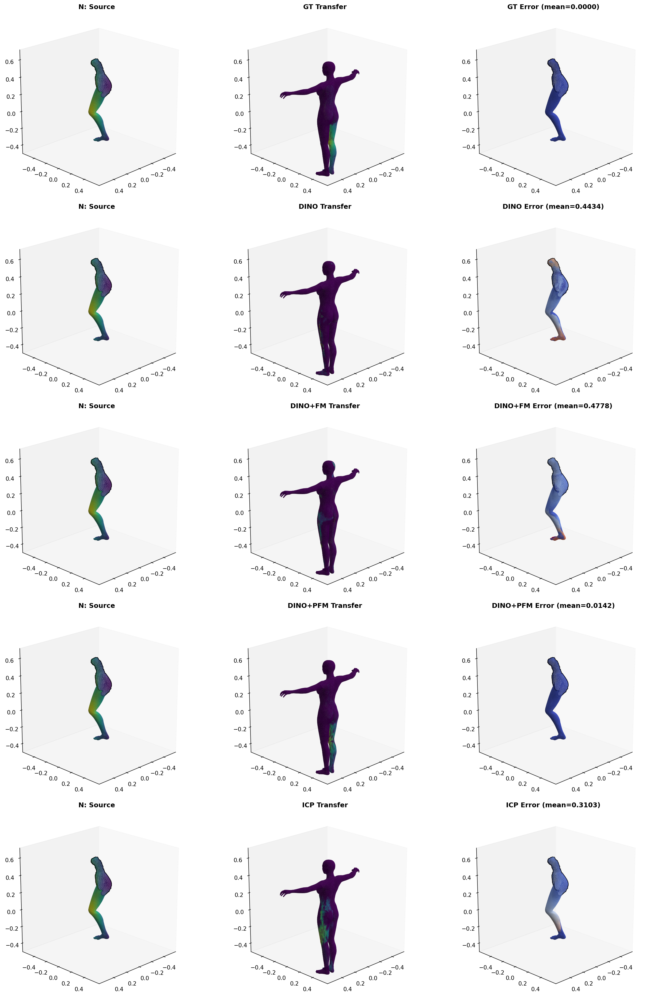

# Partial Functional Maps (PFM) - Python Implementation

Comprehensive Python implementation of partial functional maps and related methods for non-rigid shape matching, including state-of-the-art feature extraction and refinement techniques.

## Overview

This repository implements the partial functional maps framework for establishing correspondences between 3D shapes with partial geometry. It combines spectral geometric methods with modern deep learning features and classical descriptors to achieve robust shape matching.

## Implemented Methods

### Core Methods

1. **Partial Functional Maps (PFM)** - Rodolà et al.
   - Spectral framework for partial shape matching
   - Handles missing geometry and topological changes
   - Laplace-Beltrami eigenbasis computation

2. **Functional Maps (FM)** - Ovsjanikov et al.
   - Complete shape correspondence framework
   - Spectral representation of correspondences
   - Foundation for partial methods

3. **Iterative Closest Point (ICP)**
   - Classical point-to-point registration
   - Baseline comparison method

### Feature Extractors

1. **DINOv2** - Meta AI
   - Self-supervised vision transformer features
   - Projection of 2D features onto 3D meshes
   - Multiple views rendering and aggregation

2. **SHOT** (Signature of Histograms of OrienTations)
   - Local geometric descriptor
   - Histogram-based feature encoding
   - Robust to noise and partial data

3. **FPFH** (Fast Point Feature Histograms)
   - Fast local geometric descriptor
   - Multi-scale neighborhood encoding
   - Efficient computation

### Method Combinations

All feature extractors can be combined with both FM and PFM refinement:
- DINO only
- DINO + FM
- DINO + PFM
- SHOT only
- SHOT + FM
- SHOT + PFM
- FPFH only
- FPFH + FM
- FPFH + PFM
- ICP (baseline)

## Benchmark Results

### Visual Comparison

Example showing correspondence quality across different methods on a challenging partial matching case:



The visualization shows source shape (left), transferred/matched shape (center), and error visualization (right) for each method. Note how:
- **Ground Truth (GT)**: Perfect correspondence (0.000 error)
- **DINO+PFM**: Achieves excellent results (0.014 error) with proper part matching
- **DINO+FM**: Moderate performance (0.478 error) - struggles with partial geometry
- **DINO alone**: Poor performance (0.443 error) without refinement
- **ICP**: Worst performer (0.310 error) - fails on partial/cut shapes

### Performance by Shape Type


Mean error across all test cases (ICP seems to perform well but usually doesn't have as full coverage over the matched shapes as the methods in question):

| Method | Mean Error |
|--------|------------|
| ICP | 0.133 |
| SHOT | 0.200 |
| SHOT+FM | 0.258 |
| SHOT+PFM | 0.120 |
| DINO | 0.238 |
| DINO+FM | 0.253 |
| DINO+PFM | 0.187 |
| FPFH | 0.520 |
| FPFH+FM | 0.525 |
| FPFH+PFM | 0.268 |

### Winner Distribution

No single method dominates across all cases. Each combination wins on different mesh pairs:

| Method | Wins | % | Avg Margin | Min Margin | Max Margin |
|--------|------|---|------------|------------|------------|
| SHOT+PFM | 82 | 41.4% | 0.0629 | 0.0000 | 0.3487 |
| DINO+PFM | 60 | 30.3% | 0.0300 | 0.0000 | 0.2366 |
| FPFH+PFM | 31 | 15.7% | 0.0455 | 0.0000 | 0.1732 |
| SHOT+argmax | 13 | 6.6% | 0.0773 | 0.0040 | 0.2617 |
| DINO+FM | 5 | 2.5% | 0.0261 | 0.0074 | 0.0538 |
| SHOT+FM | 4 | 2.0% | 0.0437 | 0.0295 | 0.0641 |
| DINO+argmax | 3 | 1.5% | 0.0196 | 0.0006 | 0.0386 |

**Key insight**: For optimal results, test all combinations and select the best performer per case. The average doesn't tell the whole story - different methods excel on different shape types and deformation patterns.

### Performance Characteristics by Shape

- **Cat**: PFM methods consistently strong (DINO+PFM, SHOT+PFM best)
- **Centaur**: SHOT-based methods excel, especially with PFM refinement
- **David**: High variability, no clear winner - test all methods
- **Dog**: SHOT+PFM and DINO+PFM competitive across all variants
- **Horse**: Classical SHOT performs well, PFM refinement helps
- **Michael**: Mixed results, SHOT+PFM edges ahead
- **Victoria**: DINO+PFM shows strong performance
- **Wolf**: ICP surprisingly effective, geometric descriptors strong

## Installation

### Recommended: Conda (Fast & Reliable)

Best for most users - installs PyTorch3D and all dependencies in ~10 minutes:

```bash
# Create environment
conda create -n pfm python=3.10 -y
conda activate pfm

# Core dependencies
conda install -c conda-forge matplotlib=3.7.1 numpy=1.25.0 scikit-learn=1.2.2 scipy=1.10.1 -y

# PyTorch (adjust cuda version as needed)
pip install torch==2.1.0 torchvision

# 3D/Geometry packages
conda install -c fvcore -c iopath -c conda-forge fvcore iopath -y
pip install --no-index --no-cache-dir pytorch3d -f https://dl.fbaipublicfiles.com/pytorch3d/packaging/wheels/py310_cu121_pyt210/download.html

# Other dependencies
pip install open3d robust_laplacian==0.2.7 trimesh==4.0.0 potpourri3d==1.0.0
pip install transformers==4.34.1 huggingface-hub==0.17.3
pip install einops==0.7.0 meshio==5.3.4 opencv-python==4.8.1.78 plyfile==1.0.1
```

**See [INSTALLATION.md](INSTALLATION.md) for complete conda installation instructions and verification steps.**

### Alternative: Python venv

If you cannot use conda (e.g., restricted environments), use the automated setup script. **Note**: PyTorch3D compilation may take 30+ minutes:

```bash
python3 setup_environment.py
source .venv/bin/activate
```

**See [SETUP_ALTERNATIVE.md](SETUP_ALTERNATIVE.md) for venv installation options.**

## Quick Start

### Basic Usage

```python
from pfm_py import PartialFunctionalMap, compute_laplacian_basis
import numpy as np

# Load meshes (vertices, faces)
source_verts, source_faces = load_mesh("source.obj")
target_verts, target_faces = load_mesh("target.obj")

# Compute spectral basis
k = 50
source_evecs, source_evals = compute_laplacian_basis(source_verts, source_faces, k)
target_evecs, target_evals = compute_laplacian_basis(target_verts, target_faces, k)

# Extract features (e.g., SHOT descriptors)
source_features = extract_shot(source_verts, source_faces)
target_features = extract_shot(target_verts, target_faces)

# Compute partial functional map
pfm = PartialFunctionalMap(source_evecs, target_evecs, source_evals, target_evals)
C = pfm.compute(source_features, target_features)

# Convert to point-to-point map
p2p = pfm.fmap_to_p2p(C, source_evecs, target_evecs)
```

### Running Benchmarks

```bash
# Full benchmark across all methods
python benchmark_Dinov3_only.py

# Results saved to benchmark_results.json and benchmark_results.md
```

## Project Structure

```
pfm/
├── pfm_py/                  # Core implementation
│   ├── functional_maps.py   # FM/PFM algorithms
│   ├── features.py          # Feature extraction (DINO, SHOT, FPFH)
│   ├── geometry.py          # Mesh utilities, Laplacian computation
│   └── visualization.py     # Result visualization
├── examples/                # Usage examples
├── benchmark_Dinov3_only.py # Benchmark runner
└── requirements.txt         # Dependencies
```

## Key Features

- **Spectral Methods**: Laplace-Beltrami eigenbasis computation with cotangent weights
- **Modern Features**: DINOv2 self-supervised features via multi-view rendering
- **Classical Descriptors**: SHOT and FPFH for geometric feature extraction
- **Refinement**: Both full and partial functional map refinement
- **Comprehensive Benchmarks**: Automated testing across multiple shape categories
- **Visualization**: Built-in tools for correspondence visualization

## Dataset

Benchmarks use the SHREC dataset with two challenge types:
- **cuts**: Shapes with removed parts
- **holes**: Shapes with topological holes

Test shapes include: cat, centaur, david, dog, horse, michael, victoria, wolf

## References

- Rodolà et al. - Partial Functional Correspondence
- Ovsjanikov et al. - Functional Maps Framework
- Meta AI - DINOv2: Learning Robust Visual Features
- Tombari et al. - SHOT Descriptor
- Rusu et al. - FPFH Descriptor

## License

MIT License
