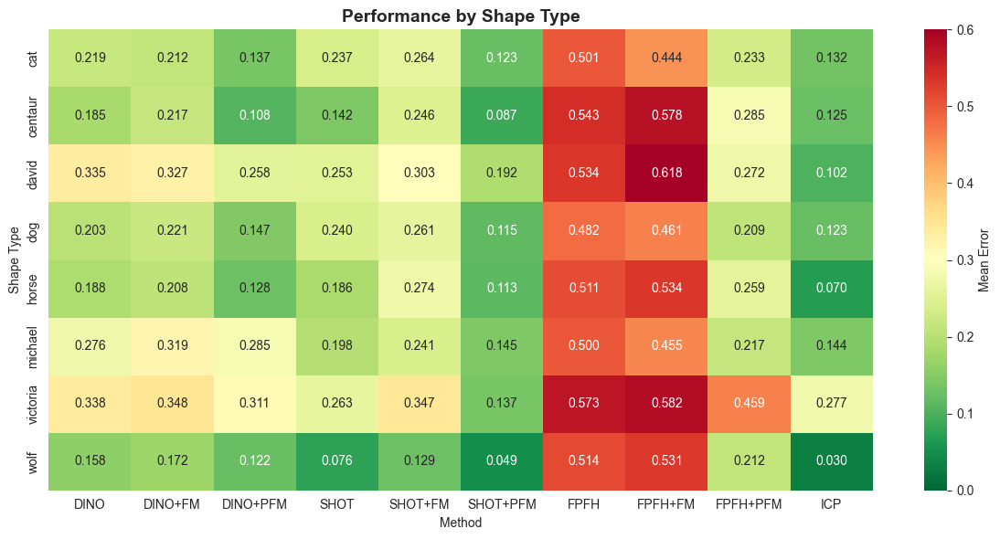

# Partial Functional Maps (PFM) - Python Implementation

Comprehensive Python implementation of partial functional maps and related methods for non-rigid shape matching, including state-of-the-art feature extraction and refinement techniques.

## Overview

This repository is a **Python reimplementation** of the [original MATLAB Partial Functional Maps (PFM) repository](https://github.com/pitbullil/PFM/tree/master/pfm), based on the foundational paper:

**[Partial Functional Correspondence](https://arxiv.org/pdf/1506.05274)** by Rodolà et al.

The implementation reproduces the core PFM framework for establishing correspondences between 3D shapes with partial geometry. Beyond the original MATLAB implementation (which uses SHOT descriptors), this Python version extends the framework with:
- **Deep learning-based descriptors**: DINOv2 and DINOv3 (self-supervised vision transformers)
- **Additional classical descriptors**: FPFH (Fast Point Feature Histograms)
- **Flexible descriptor combinations**: Different types of descriptors can be freely combined.

## Benchmark Results

### Performance by Shape Type



Mean error across all test cases (ICP seems to perform well but usually doesn't have as full coverage over the matched shapes as the methods in question):

| Method | Mean Error |
|--------|------------|
| ICP | 0.133 |
| SHOT | 0.200 |
| SHOT+FM | 0.258 |
| SHOT+PFM | 0.120 |
| DINO | 0.238 |
| DINO+FM | 0.253 |
| DINO+PFM | 0.187 |
| FPFH | 0.520 |
| FPFH+FM | 0.525 |
| FPFH+PFM | 0.268 |

### Winner Distribution

No single method dominates across all cases. Each combination wins on different mesh pairs:

| Method | Wins | % | Avg Margin | Min Margin | Max Margin |
|--------|------|---|------------|------------|------------|
| SHOT+PFM | 82 | 41.4% | 0.0629 | 0.0000 | 0.3487 |
| DINO+PFM | 60 | 30.3% | 0.0300 | 0.0000 | 0.2366 |
| FPFH+PFM | 31 | 15.7% | 0.0455 | 0.0000 | 0.1732 |
| SHOT+argmax | 13 | 6.6% | 0.0773 | 0.0040 | 0.2617 |
| DINO+FM | 5 | 2.5% | 0.0261 | 0.0074 | 0.0538 |
| SHOT+FM | 4 | 2.0% | 0.0437 | 0.0295 | 0.0641 |
| DINO+argmax | 3 | 1.5% | 0.0196 | 0.0006 | 0.0386 |

**Key insight**: For optimal results, test all combinations and select the best performer per case. The average doesn't tell the whole story - different methods excel on different shape types and deformation patterns.

### Performance Characteristics by Shape

- **Cat**: PFM methods consistently strong (DINO+PFM, SHOT+PFM best)
- **Centaur**: SHOT-based methods excel, especially with PFM refinement
- **David**: High variability, no clear winner - test all methods
- **Dog**: SHOT+PFM and DINO+PFM competitive across all variants
- **Horse**: Classical SHOT performs well, PFM refinement helps
- **Michael**: Mixed results, SHOT+PFM edges ahead
- **Victoria**: DINO+PFM shows strong performance
- **Wolf**: ICP surprisingly effective, geometric descriptors strong

## Installation

### Recommended: Conda (Fast & Reliable)

Best for most users - installs PyTorch3D and all dependencies in ~10 minutes:

```bash
# Create environment
conda create -n pfm python=3.10 -y
conda activate pfm

# Core dependencies
conda install -c conda-forge matplotlib=3.7.1 numpy=1.25.0 scikit-learn=1.2.2 scipy=1.10.1 -y

# PyTorch (adjust cuda version as needed)
pip install torch==2.1.0 torchvision

# 3D/Geometry packages
conda install -c fvcore -c iopath -c conda-forge fvcore iopath -y
pip install --no-index --no-cache-dir pytorch3d -f https://dl.fbaipublicfiles.com/pytorch3d/packaging/wheels/py310_cu121_pyt210/download.html

# Other dependencies
pip install open3d robust_laplacian==0.2.7 trimesh==4.0.0 potpourri3d==1.0.0
pip install transformers==4.34.1 huggingface-hub==0.17.3
pip install einops==0.7.0 meshio==5.3.4 opencv-python==4.8.1.78 plyfile==1.0.1
```

**See [INSTALLATION.md](INSTALLATION.md) for complete conda installation instructions and verification steps.**

## CLI Usage

PFM provides a simple CLI for single runs and dataset processing. The entry point is [pfm_py/main.py](pfm_py/main.py).

### Available CLI Options

#### Descriptor Selection (choose one or combine with `--desc`)
- `--fpfh` - Use FPFH descriptors (Fast Point Feature Histograms)
- `--shot` - Use SHOT descriptors (Signature of Histograms of Orientations)
- `--dino` - Use DINO (DINOv2) descriptors (requires pytorch3d and internet)
- `--dinov3` or `--dino3` - Use DINOv3 descriptors (requires pytorch3d, transformers and internet)
- `--desc <TYPE>` - Specify custom descriptor type (can be used multiple times, e.g., `--desc shot --desc fpfh`)
  - Supports combinations like `shot+dino` or `fpfh+dinov3`
  - Default: `fpfh` (if no descriptors specified)

#### Input/Output Paths
- `--full-mesh <PATH>` - Path to full mesh (.off file) or directory containing full meshes
  - If directory, auto-resolves full mesh from partial name
  - E.g., `horse_shape_14.off` tries candidates: `horse_shape_14.off` → `horse.off` → fallback to same basename
- `--partial-mesh <PATH>` - Path to partial mesh (.off file) to match
- `--gt-path <PATH>` - Optional path to ground truth correspondences (.vts file)
  - If omitted, GT-based metrics/visualizations are skipped
- `--target-path <PATH>` - Output results directory (default: `results`)
- `--shrec16 <PATH>` - Path to SHREC16 root directory (contains cuts/holes/null subdirectories)
  - Required for dataset mode (when `--full-mesh`/`--partial-mesh` not provided)

#### Visualization Options
- `--web-view` - Generate interactive HTML+JSON 3D viewer in result folder
  - Left panel: full mesh with continuous colors
  - Right panel: partial mesh with method/GT colors
  - Features: rotate, zoom, pan, method/GT toggle
- `--no-vis` - Skip generation of visualizations (functional map and color pullback images)

#### Optimization Overrides
- `--v-max-iter <INT>` - Override max iterations for v optimization (default: 2000)
- `--C-max-iter <INT>` - Override max iterations for functional map C optimization (default: 2000)
- `--max-outer-iter <INT>` - Override max outer loop iterations (default: 7)

### CLI Examples

```bash
# Single run with SHOT descriptors
python3 -m pfm_py.main \
   --full-mesh /path/to/full.off \
   --partial-mesh /path/to/partial.off \
   --shot \
   --target-path results/shot_single

# Single run with DINOv3 + ground truth
python3 -m pfm_py.main \
   --full-mesh /path/to/full.off \
   --partial-mesh /path/to/partial.off \
   --gt-path /path/to/corres.vts \
   --dinov3 \
   --target-path results/dinov3_with_gt

# Combine multiple descriptors
python3 -m pfm_py.main \
   --full-mesh /path/to/full.off \
   --partial-mesh /path/to/partial.off \
   --desc shot+fpfh \
   --target-path results/shot_fpfh_combined

# Auto-resolve full mesh from directory
python3 -m pfm_py.main \
   --full-mesh /usr/prakt/w0010/SAVHA/shape_data/SHREC16/null/off \
   --partial-mesh /usr/prakt/w0010/SAVHA/shape_data/SHREC16/cuts/off/cuts_horse_shape_14.off \
   --dinov3 \
   --target-path results/dinov3

# SHREC16 dataset with multiple descriptors and web viewer
python3 -m pfm_py.main \
   --shrec16 /usr/prakt/w0010/SAVHA/shape_data/SHREC16 \
   --shot --fpfh \
   --target-path results \
   --web-view \
   --max-outer-iter 5 \
   --C-max-iter 1500 \
   --v-max-iter 1000

# Custom iteration parameters
python3 -m pfm_py.main \
   --full-mesh /path/to/full.off \
   --partial-mesh /path/to/partial.off \
   --dino \
   --v-max-iter 3000 \
   --C-max-iter 2500 \
   --max-outer-iter 10 \
   --target-path results/dino_custom_iters
```

### Output Files

When `--target-path` is specified, the following files are generated per mesh pair:
- `correspondence.vts` - Computed pointwise correspondences (vertices of N → vertices of M), 1-indexed, one per line
- `functional_map_visualization.png` - Visualization of the functional map and color transfers
- `color_pullback_visualization.png` - Color pullback and error heatmap visualizations
- `interactive_view.html` - Interactive 3D web viewer (if `--web-view` enabled)

### Environment Variables

- `PFM_DINO_MODEL` - Override default DINO/DINOv3 model ID
- `HF_TOKEN` - Hugging Face token for accessing gated models (required for some model versions)

### Notes

- When `--full-mesh` is a directory, the CLI auto-resolves candidates from the partial mesh name
- Default descriptor is `fpfh` if none specified
- Multiple descriptors can be combined using `+` or `--desc` repeated multiple times
- Ground truth comparisons require GT file; omit `--gt-path` to skip GT-based metrics
- To run all available descriptors individually, use `--fpfh --shot --dino --dinov3` flags together

## Web Viewer (Interactive HTML)

- Purpose: Generate an interactive 3D page. Left panel shows the full mesh (continuous colors), right panel shows the partial mesh (method/GT colors), with rotate, zoom, pan and Method/GT toggle.
- Enable: Add `--web-view` to the CLI; an `interactive_view.html` is created per sample inside the result folder.

## Key Features

- **Spectral Methods**: Laplace-Beltrami eigenbasis computation with cotangent weights
- **Modern Features**: DINOv2 self-supervised features via multi-view rendering
- **Classical Descriptors**: SHOT and FPFH for geometric feature extraction
- **Refinement**: Both full and partial functional map refinement
- **Comprehensive Benchmarks**: Automated testing across multiple shape categories
- **Visualization**: Built-in tools for correspondence visualization

## Dataset

Benchmarks use the SHREC dataset with two challenge types:
- **cuts**: Shapes with removed parts
- **holes**: Shapes with topological holes

Test shapes include: cat, centaur, david, dog, horse, michael, victoria, wolf

## References

- [Partial Functional Correspondence](https://arxiv.org/pdf/1506.05274) - Rodolà et al.
- [Functional Maps Framework](https://arxiv.org/abs/1202.3673) - Ovsjanikov et al.
- [DINOv2: Learning Robust Visual Features](https://arxiv.org/abs/2304.07193) - Meta AI Research
- [DINOv3 Repository](https://github.com/facebookresearch/dinov3) - Meta AI Research
- SHOT Descriptor - Tombari et al.
- FPFH Descriptor - Rusu et al.
- [Original MATLAB PFM Repository](https://github.com/pitbullil/PFM/tree/master/pfm) - Reference implementation

## License

MIT License
